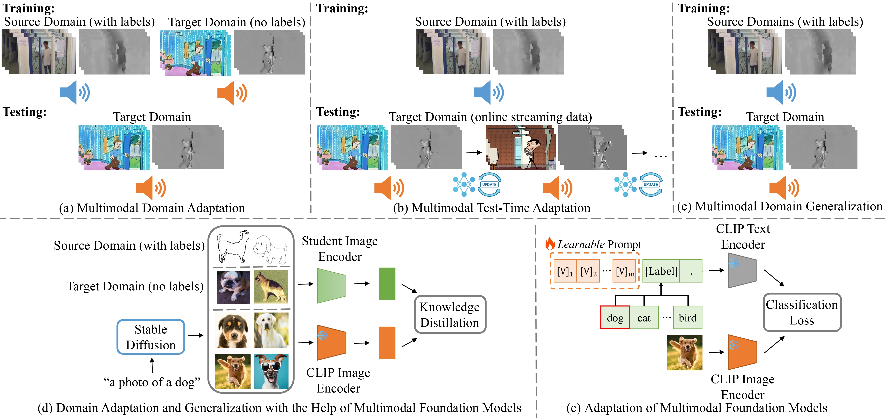

<div align="center">

<h1>Advances in Multimodal Adaptation and Generalization: From Traditional Approaches to Foundation Models</h1>

<div>
    <h4 align="center">
        • <a href="https://arxiv.org/abs/2501.18592" target='_blank'>arXiv 2025</a> •
    </h4>
</div>


<div style="text-align:center">

</div>

---

</div>


Five multimodal adaptation scenarios are discussed in this survey. (a) Multimodal domain adaptation, (b) Multimodal test-time adaptation, and (c) Multimodal domain generalization, which represent traditional multimodal settings with varying access to source and target domain data. Additionally, we examine more recent foundation models including (d) unimodal domain adaptation and generalization assisted by multimodal foundation models, and (e) the adaptation of multimodal foundation models to downstream tasks.

🤗 Contributions to new resources and articles are always welcome!

## Citation

If you find our work useful in your research please consider citing our [paper](https://arxiv.org/abs/2501.18592):


```
@article{dong2025mmdasurvey,
	author   = {Dong, Hao and Liu, Moru and Zhou, Kaiyang and Chatzi, Eleni and Kannala, Juho and Stachniss, Cyrill and Fink, Olga},
	title    = {Advances in Multimodal Adaptation and Generalization: From Traditional Approaches to Foundation Models},
	journal  = {arXiv preprint arXiv:2501.18592},
	year     = {2025},
}
```

## Table of Contents

- [Citation](#citation)
- [Table of Contents](#table-of-contents)
- [Multimodal Domain Adaptation](#multimodal-domain-adaptation)
  - [Action Recognition](#action-recognition)
  - [Semantic Segmentation](#semantic-segmentation)
  - [Other Tasks](#other-tasks)
- [Multimodal Test-time Adaptation](#multimodal-test-time-adaptation)
  - [Action Recognition](#action-recognition-1)
  - [Semantic Segmentation](#semantic-segmentation-1)
  - [Other Tasks](#other-tasks-1)
- [Multimodal Domain Generalization](#multimodal-domain-generalization)
  - [Action Recognition](#action-recognition-2)
  - [Semantic Segmentation](#semantic-segmentation-2)
  - [Other Tasks](#other-tasks-2)
- [Domain Adaptation and Generalization with the Help of Multimodal Foundation Models](#domain-adaptation-and-generalization-with-the-help-of-multimodal-foundation-models)
  - [Data Augmentation](#data-augmentation)
  - [Knowledge Distillation](#knowledge-distillation)
  - [Learning Strategies](#learning-strategies)
- [Adaptation of Multimodal Foundation Models](#adaptation-of-multimodal-foundation-models)
  - [Prompt-based Adaptation](#prompt-based-adaptation)
  - [Adapter-based Adaptation](#adapter-based-adaptation)
  - [Other Adaptation Methods](#other-adaptation-methods)


## Multimodal Domain Adaptation

### Action Recognition

(ACM MM 2018) [A Unified Framework for Multimodal Domain Adaptation](https://dl.acm.org/doi/pdf/10.1145/3240508.3240633) by Qi et al.


(CVPR 2020) [Multi-Modal Domain Adaptation for Fine-Grained Action Recognition](https://arxiv.org/abs/2001.09691) [[Code]](https://github.com/jonmun/MM-SADA-code) by Munro et al.

(CVPR 2021) [Spatio-temporal Contrastive Domain Adaptation for Action Recognition](https://openaccess.thecvf.com/content/CVPR2021/papers/Song_Spatio-temporal_Contrastive_Domain_Adaptation_for_Action_Recognition_CVPR_2021_paper.pdf) by Song et al.

(ICCV 2021) [Learning Cross-modal Contrastive Features for Video Domain Adaptation](https://arxiv.org/abs/2108.11974) by Kim et al.

(TIP 2021) [Progressive Modality Cooperation for Multi-Modality Domain Adaptation](https://ieeexplore.ieee.org/document/9334409) by Zhang et al.


(ACM MM 2021) [Differentiated Learning for Multi-Modal Domain Adaptation](https://dl.acm.org/doi/pdf/10.1145/3474085.3475660) by Lv et al.


(CVPR 2022) [Audio-Adaptive Activity Recognition Across Video Domains](https://arxiv.org/abs/2203.14240) [[Code]](https://github.com/xiaobai1217/DomainAdaptation) by Zhang et al.

(CVPR 2022) [Interact before Align: Leveraging Cross-Modal Knowledge for Domain Adaptive Action Recognition](https://openaccess.thecvf.com/content/CVPR2022/papers/Yang_Interact_Before_Align_Leveraging_Cross-Modal_Knowledge_for_Domain_Adaptive_Action_CVPR_2022_paper.pdf) by Yang et al.

(ACM MM 2022) [Relative Alignment Network for Source-Free Multimodal Video Domain Adaptation](https://dl.acm.org/doi/pdf/10.1145/3503161.3548009) by Huang et al.

(ACM MM 2022) [Mix-DANN and Dynamic-Modal-Distillation for Video Domain Adaptation](https://dl.acm.org/doi/pdf/10.1145/3503161.3548313) by Yin et al.

(ECCV 2024) [Towards Multimodal Open-Set Domain Generalization and Adaptation through Self-supervision](https://arxiv.org/abs/2407.01518) [[Code]](https://github.com/donghao51/MOOSA) by Dong et al.


### Semantic Segmentation
(CVPR 2020) [xMUDA: Cross-Modal Unsupervised Domain Adaptation for 3D Semantic Segmentation](https://arxiv.org/abs/1911.12676) [[Code]](https://github.com/valeoai/xmuda) by Jaritz et al.

(ICCV 2021) [Sparse-to-dense Feature Matching: Intra and Inter domain Cross-modal Learning in Domain Adaptation for 3D Semantic Segmentation](https://arxiv.org/abs/2107.14724) [[Code]](https://github.com/leolyj/DsCML) by Peng et al.

(ISPRS 2021) [Adversarial unsupervised domain adaptation for 3D semantic segmentation with multi-modal learning](https://www.sciencedirect.com/science/article/pii/S0924271621001131) by Liu et al.

(ECCV 2022) [Drive&Segment: Unsupervised Semantic Segmentation of Urban Scenes via Cross-modal Distillation](https://arxiv.org/abs/2203.11160) [[Code]](https://github.com/vobecant/DriveAndSegment) by Vobecky et al.

(TPAMI 2022) [Cross-modal Learning for Domain Adaptation
in 3D Semantic Segmentation](https://arxiv.org/abs/2101.07253) [[Code]](https://github.com/valeoai/xmuda_journal) by Jaritz et al.

(ACM MM 2022) [Cross-Domain and Cross-Modal Knowledge Distillation in Domain Adaptation for 3D Semantic Segmentation](https://dl.acm.org/doi/pdf/10.1145/3503161.3547990) by Li et al.

(ACM MM 2022) [Self-supervised Exclusive Learning for 3D Segmentation with Cross-modal Unsupervised Domain Adaptation](https://dl.acm.org/doi/pdf/10.1145/3503161.3547987) by Zhang et al.

(ICCV 2023) [CrossMatch: Source-Free Domain Adaptive Semantic Segmentation via Cross-Modal Consistency Training](https://openaccess.thecvf.com/content/ICCV2023/papers/Yin_CrossMatch_Source-Free_Domain_Adaptive_Semantic_Segmentation_via_Cross-Modal_Consistency_Training_ICCV_2023_paper.pdf) by Yin et al.

(ICCV 2023) [SUMMIT: Source-Free Adaptation of Uni-Modal Models to Multi-Modal Targets](https://openaccess.thecvf.com/content/ICCV2023/papers/Simons_SUMMIT_Source-Free_Adaptation_of_Uni-Modal_Models_to_Multi-Modal_Targets_ICCV_2023_paper.pdf) [[Code]](https://github.com/csimo005/SUMMIT) by Simons et al.


(AAAI 2023) [Cross-Modal Contrastive Learning for Domain Adaptation in 3D Semantic Segmentation](https://ojs.aaai.org/index.php/AAAI/article/download/25400/25172) by Xing et al.

(RAS 2023) [Real-time multi-modal semantic fusion on unmanned aerial vehicles with label propagation for cross-domain adaptation](https://www.sciencedirect.com/science/article/pii/S0921889022001750) by Bultmann et al.

(CVPRW 2023) [Exploiting the Complementarity of 2D and 3D Networks to Address Domain-Shift in 3D Semantic Segmentation](https://arxiv.org/abs/2304.02991) by Cardace et al.


(IROS 2023) [DualCross: Cross-Modality Cross-Domain Adaptation for Monocular BEV Perception](https://arxiv.org/abs/2305.03724) [[Code]](https://github.com/YunzeMan/DualCross) by Man et al.

(ACM MM 2023) [Cross-modal & Cross-domain Learning for Unsupervised LiDAR Semantic Segmentation](https://dl.acm.org/doi/pdf/10.1145/3581783.3612320) by Chen et al.

(ACM MM 2023) [Cross-modal Unsupervised Domain Adaptation for 3D Semantic Segmentation via Bidirectional Fusion-then-Distillation](https://dl.acm.org/doi/pdf/10.1145/3581783.3612013) by Wu et al.

(AAAI 2023) [Mx2M: Masked Cross-Modality Modeling in Domain Adaptation for 3D Semantic Segmentation](https://ojs.aaai.org/index.php/AAAI/article/view/25448) by Zhang et al.

(ICRA 2024) [MoPA: Multi-Modal Prior Aided Domain Adaptation for 3D Semantic Segmentation](https://arxiv.org/abs/2309.11839) [[Code]](https://github.com/AronCao49/MoPA) by Cao et al.

(ECCV 2024) [MICDrop: Masking Image and Depth Features via Complementary Dropout for Domain-Adaptive Semantic Segmentation](https://arxiv.org/pdf/2408.16478) by Yang et al.

(NeurIPS 2024) [UniDSeg: Unified Cross-Domain 3D Semantic Segmentation via Visual Foundation Models Prior](https://openreview.net/pdf?id=dDDc3iNZA7) by Wu et al.

(ACM MM 2024) [CLIP2UDA: Making Frozen CLIP Reward Unsupervised Domain Adaptation in 3D Semantic Segmentation](https://dl.acm.org/doi/pdf/10.1145/3581783.3612013) by Wu et al.

(ICRA 2025) [SAM-guided Pseudo Label Enhancement for Multi-modal 3D Semantic Segmentation](https://arxiv.org/abs/2502.00960) by Yang et al.


### Other Tasks

(TMM 2019) [Deep Multi-Modality Adversarial Networks for Unsupervised Domain Adaptation](https://ieeexplore.ieee.org/document/8656504) by Ma et al.

(JBHI 2022) [A Novel 3D Unsupervised Domain Adaptation Framework for Cross-Modality Medical Image Segmentation](https://ieeexplore.ieee.org/abstract/document/9741336) by Yao et al.

(CVPR 2023) [OSAN: A One-Stage Alignment Network to Unify Multimodal Alignment and Unsupervised Domain Adaptation](https://openaccess.thecvf.com/content/CVPR2023/papers/Liu_OSAN_A_One-Stage_Alignment_Network_To_Unify_Multimodal_Alignment_and_CVPR_2023_paper.pdf) by Liu et al.

(ACL 2024) [Amanda: Adaptively Modality-Balanced Domain Adaptation for Multimodal Emotion Recognition](https://aclanthology.org/2024.findings-acl.859/) by Zhang et al.

(WACVW 2024) [Source-Free Domain Adaptation for RGB-D Semantic Segmentation with Vision Transformers](https://arxiv.org/abs/2305.14269) by Rizzoli et al.


(CVPR 2025) [MODfinity Unsupervised Domain Adaptation with Multimodal Information Flow](https://cvpr.thecvf.com/virtual/2025/poster/34951) by Liu et al.


## Multimodal Test-time Adaptation
### Action Recognition

(ICLR 2024) [Test-time Adaptation against Multi-modal Reliability Bias](https://openreview.net/forum?id=TPZRq4FALB) [[Code]](https://github.com/XLearning-SCU/2024-ICLR-READ) by Yang et al.

(CVPR 2024) [Modality-Collaborative Test-Time Adaptation for Action Recognition](https://openaccess.thecvf.com/content/CVPR2024/papers/Xiong_Modality-Collaborative_Test-Time_Adaptation_for_Action_Recognition_CVPR_2024_paper.pdf) by Xiong et al.

(ICMLW 2024) [Two-Level Test-Time Adaptation in Multimodal Learning](https://openreview.net/forum?id=n0lDbIKVAT) by Lei et al.

(ICLR 2025) [Towards Robust Multimodal Open-set Test-time Adaptation via Adaptive Entropy-aware Optimization](https://openreview.net/forum?id=hj323oR3rw) [[Code]](https://github.com/donghao51/AEO) by Dong et al.

(ICLR 2025) [Test-Time Adaptation for Combating Missing Modalities in Egocentric Videos](https://openreview.net/forum?id=1L52bHEL5d) by Ramazanova et al.

(ICLR 2025) [Smoothing the Shift: Towards Stable Test-time Adaptation under Complex Multimodal Noises](https://openreview.net/forum?id=rObkvzJxTG) by Guo et al.

(arXiv 2024) [Analytic Continual Test-Time Adaptation for Multi-Modality Corruption](https://arxiv.org/abs/2410.22373) by Zhang et al.

(AAAI 2025) [Attention Bootstrapping for Multi-Modal Test-Time Adaptation](https://arxiv.org/abs/2503.02221) [[code]](https://github.com/YushengZhao/ABPEM) by Zhao et al.


### Semantic Segmentation

(CVPR 2022) [MM-TTA: Multi-Modal Test-Time Adaptation for 3D Semantic Segmentation](https://arxiv.org/abs/2204.12667) by Shin et al.

(CVPR 2023) [Multi-Modal Continual Test-Time Adaptation for 3D Semantic Segmentation](https://arxiv.org/abs/2303.10457) by Cao et al.

(ECCV 2024) [Reliable Spatial-Temporal Voxels For Multi-Modal Test-Time Adaptation](https://arxiv.org/abs/2403.06461) [[Code]](https://github.com/AronCao49/Latte/) by Cao et al.


### Other Tasks
(arXiv 2023) [Test-Time Adaptation for Nighttime Color-Thermal Semantic Segmentation](https://arxiv.org/abs/2307.04470) by Liu et al.

(AAAI 2024) [Heterogeneous Test-Time Training for Multi-Modal Person Re-identification](https://ojs.aaai.org/index.php/AAAI/article/view/28398) by Wang et al.

(IJCAI 2024) [ATTA: adaptive test-time adaptation for multi-modal sleep stage classification](https://www.ijcai.org/proceedings/2024/0650.pdf) by Jia et al.

(CVPR 2024) [Test-Time Adaptation for Depth Completion](https://arxiv.org/abs/2402.03312) [[Code]](https://github.com/seobbro/TTA-depth-completion) by Park et al.

(arXiv 2024) [Bridging the Gap for Test-Time Multimodal Sentiment Analysis](https://arxiv.org/pdf/2412.07121) by Guo et al.


(ICLR 2025) [Test-time Adaptation for Cross-modal Retrieval with Query Shift](https://openreview.net/forum?id=BmG88rONaU) by Li et al.


## Multimodal Domain Generalization
### Action Recognition
(WACV 2022) [Domain Generalization through Audio-Visual Relative Norm Alignment in First Person Action Recognition](https://openaccess.thecvf.com/content/WACV2022/papers/Planamente_Domain_Generalization_Through_Audio-Visual_Relative_Norm_Alignment_in_First_Person_WACV_2022_paper.pdf) by Planamente et al.

(NeurIPS 2023) [SimMMDG: A Simple and Effective Framework for Multi-modal Domain Generalization](https://arxiv.org/abs/2310.19795) [[Code]](https://github.com/donghao51/SimMMDG) by Dong et al.


(ECCV 2024) [Towards Multimodal Open-Set Domain Generalization and Adaptation through Self-supervision](https://arxiv.org/abs/2407.01518) [[Code]](https://github.com/donghao51/MOOSA) by Dong et al.

(IJCV 2024) [Relative Norm Alignment for Tackling Domain Shift in Deep Multi-modal Classification](https://link.springer.com/article/10.1007/s11263-024-01998-9) by Planamente et al.

(NeurIPS 2024) [Cross-modal Representation Flattening for Multi-modal Domain Generalization](https://openreview.net/pdf?id=UixTytSVOl) [[Code]](https://github.com/fanyunfeng-bit/Cross-modal-Representation-Flattening-for-MMDG) by Fan et al.

(ICASSP 2025) [Integrating Audio Narrations to Strengthen Domain Generalization in Multimodal First-Person Action Recognition](https://www.arxiv.org/pdf/2409.09611) by Gungor et al.

### Semantic Segmentation
(ICCV 2023) [BEV-DG: Cross-Modal Learning under Bird’s-Eye View for Domain Generalization of 3D Semantic Segmentation](https://arxiv.org/abs/2308.06530) by Li et al.

### Other Tasks

(ICASSP 2023) [Multi-Modal Domain Generalization for Cross-Scene Hyperspectral Image Classification](https://ieeexplore.ieee.org/document/10095723) by Zhang et al.

(TGRS 2024) [Instance-Wise Domain Generalization for Cross-Scene Wetland Classification With Hyperspectral and LiDAR Data](https://ieeexplore.ieee.org/abstract/document/10806800) by Guo et al.


## Domain Adaptation and Generalization with the Help of Multimodal Foundation Models

### Data Augmentation
(ICLR 2023) [Using Language to Extend to Unseen Domains](https://arxiv.org/abs/2210.09520) [[Code]](https://github.com/lisadunlap/LADS) by Dunlap et al.

(CVPR 2023) [CLIP the Gap: A Single Domain Generalization Approach for Object Detection](https://openaccess.thecvf.com/content/CVPR2023/papers/Vidit_CLIP_the_Gap_A_Single_Domain_Generalization_Approach_for_Object_CVPR_2023_paper.pdf) by Vidit et al.

(ICCV 2023) [PØDA: Prompt-driven Zero-shot Domain Adaptation](https://arxiv.org/abs/2212.03241) [[Code]](https://github.com/astra-vision/PODA) by Fahes et al.

(ICCV 2023) [PromptStyler: Prompt-driven Style Generation for Source-free Domain Generalization](https://openaccess.thecvf.com/content/ICCV2023/papers/Cho_PromptStyler_Prompt-driven_Style_Generation_for_Source-free_Domain_Generalization_ICCV_2023_paper.pdf) by Cho et al.

(ICMLW 2024) [Leveraging Generative Foundation Models for Domain Generalization](https://openreview.net/pdf?id=AycNSoRjbi) by Hemati et al.

(CVPR 2024) [Collaborating Foundation Models for Domain Generalized Semantic Segmentation](https://arxiv.org/abs/2312.09788) [[Code]](https://github.com/yasserben/CLOUDS) by Benigmim et al.

(CVPR 2024) [Unknown Prompt, the only Lacuna: Unveiling CLIP's Potential for Open Domain Generalization](https://arxiv.org/abs/2404.00710) [[Code]](https://github.com/mainaksingha01/ODG-CLIP) by Singha et al.

(CVPR 2024) [Unified Language-driven Zero-shot Domain Adaptation](https://arxiv.org/pdf/2404.07155) [[Code]](https://github.com/Yangsenqiao/ULDA/) by Yang et al.

(ECCV 2024) [DGInStyle: Domain-Generalizable Semantic Segmentation with Image Diffusion Models and Stylized Semantic Control](https://arxiv.org/abs/2312.03048) [[Code]](https://github.com/prs-eth/DGInStyle) by Jia et al.

(CVPR 2025) [DriveGEN: Generalized and Robust 3D Detection in Driving via Controllable Text-to-Image Diffusion Generation](https://arxiv.org/pdf/2503.11122) by Lin et al.

### Knowledge Distillation

(ICCV 2023) [A Sentence Speaks a Thousand Images: Domain Generalization through Distilling CLIP with Language Guidance](https://openaccess.thecvf.com/content/ICCV2023/papers/Huang_A_Sentence_Speaks_a_Thousand_Images_Domain_Generalization_through_Distilling_ICCV_2023_paper.pdf) by Huang et al.

(ICCV 2023) [The Unreasonable Effectiveness of Large Language-Vision Models for Source-free Video Domain Adaptation](https://arxiv.org/abs/2308.09139) [[Code]](https://github.com/giaczara/dallv) by Zara et al.

(ICCV 2023) [Distilling Large Vision-Language Model with Out-of-Distribution Generalizability](https://openaccess.thecvf.com/content/ICCV2023/papers/Li_Distilling_Large_Vision-Language_Model_with_Out-of-Distribution_Generalizability_ICCV_2023_paper.pdf) [[Code]](https://github.com/xuanlinli17/large_vlm_distillation_ood) by Li et al.

(CVPR 2024) [PracticalDG: Perturbation Distillation on Vision-Language Models for Hybrid Domain Generalization](https://openaccess.thecvf.com/content/CVPR2024/papers/Chen_PracticalDG_Perturbation_Distillation_on_Vision-Language_Models_for_Hybrid_Domain_Generalization_CVPR_2024_paper.pdf) by Chen et al.

(CVPR 2024) [Source-Free Domain Adaptation with Frozen Multimodal Foundation Model](https://arxiv.org/abs/2311.16510) [[Code]](https://github.com/tntek/source-free-domain-adaptation) by Tang et al.

(CVPR 2024) [Leveraging Vision-Language Models for Improving Domain Generalization in Image Classification](https://openaccess.thecvf.com/content/CVPR2024/papers/Addepalli_Leveraging_Vision-Language_Models_for_Improving_Domain_Generalization_in_Image_Classification_CVPR_2024_paper.pdf) by Addepalli et al.

(ECCV 2024) [Improving Zero-shot Generalization of Learned Prompts via Unsupervised Knowledge Distillation](https://arxiv.org/abs/2407.03056) [[Code]](https://github.com/miccunifi/KDPL) by Mistretta et al.


### Learning Strategies


(arXiv 2021) [Domain Prompt Learning for Efficiently Adapting CLIP to Unseen Domains](https://arxiv.org/abs/2111.12853) [[Code]](https://github.com/shogi880/DPLCLIP) by Zhang et al.


(arXiv 2022) [Prompt Vision Transformer for Domain Generalization](https://arxiv.org/abs/2208.08914) [[Code]](https://github.com/zhengzangw/DoPrompt) by Zheng et al.

(ECCV 2022) [Domain Generalization by Mutual-Information Regularization with Pre-trained Models](https://arxiv.org/abs/2203.10789) [[Code]](https://github.com/khanrc/miro) by Cha et al.


(ICLR 2022) [Optimal Representations for Covariate Shift](https://arxiv.org/abs/2201.00057) by Ruan et al.


(TNNLS 2023) [Domain Adaptation via Prompt Learning](https://arxiv.org/abs/2202.06687) [[Code]](https://github.com/LeapLabTHU/DAPrompt) by Ge et al.


(ICML 2023) [CLIPood: Generalizing CLIP to Out-of-Distributions](https://arxiv.org/abs/2302.00864) [[Code]](https://github.com/thuml/CLIPood) by Shu et al.


(CVPR 2023) [Back to the Source: Diffusion-Driven Adaptation to Test-Time Corruption](https://arxiv.org/abs/2207.03442) [[Code]](https://github.com/shiyegao/DDA) by Gao et al.


(CVPR 2023) [AutoLabel: CLIP-based framework for Open-set Video Domain Adaptation](https://arxiv.org/abs/2207.03442) [[Code]](https://github.com/gzaraunitn/autolabel) by Zara et al.


(ICCV 2023) [PADCLIP: Pseudo-labeling with Adaptive Debiasing in CLIP for Unsupervised Domain Adaptation](https://openaccess.thecvf.com/content/ICCV2023/papers/Lai_PADCLIP_Pseudo-labeling_with_Adaptive_Debiasing_in_CLIP_for_Unsupervised_Domain_ICCV_2023_paper.pdf) by Lai et al.

(NeurIPS 2023) [Multi-Prompt Alignment for Multi-Source Unsupervised Domain Adaptation](https://arxiv.org/abs/2209.15210) by Chen et al.

(NeurIPS 2023) [Diffusion-TTA: Test-time Adaptation of Discriminative Models via Generative Feedback](https://arxiv.org/abs/2311.16102) [[Code]](https://github.com/mihirp1998/Diffusion-TTA) by Prabhudesai et al.

(NeurIPS 2023) [Diffusion-Based Probabilistic Uncertainty Estimation for Active Domain Adaptation](https://proceedings.neurips.cc/paper_files/paper/2023/file/374050dc3f211267bd6bf0ea24eae184-Paper-Conference.pdf) by Du et al.


(CVPR 2024) [Disentangled Prompt Representation for Domain Generalization](https://openaccess.thecvf.com/content/CVPR2024/papers/Cheng_Disentangled_Prompt_Representation_for_Domain_Generalization_CVPR_2024_paper.pdf) by Cheng et al.


(CVPR 2024) [Stronger, Fewer, & Superior: Harnessing Vision Foundation Models for Domain Generalized Semantic Segmentation](https://arxiv.org/abs/2312.04265) [[Code]](https://github.com/w1oves/Rein) by Wei et al.


(CVPR 2024) [Unknown Prompt, the only Lacuna: Unveiling CLIP’s Potential for Open Domain Generalization](https://arxiv.org/abs/2404.00710) [[Code]](https://github.com/mainaksingha01/ODG-CLIP) by Singha et al.

(CVPR 2024) [Split to Merge: Unifying Separated Modalities for Unsupervised Domain Adaptation](https://arxiv.org/pdf/2403.06946) [[Code]](https://github.com/TL-UESTC/UniMoS) by Li et al.


(CVPR 2024) [Prompt-Driven Dynamic Object-Centric Learning for Single Domain Generalization](https://arxiv.org/pdf/2402.18447) by Li et al.


(CVPR 2024) [Any-Shift Prompting for Generalization over Distributions](https://arxiv.org/pdf/2402.10099) by Xiao et al.


(CVPRW 2024) [Exploring the Benefits of Vision Foundation Models for Unsupervised Domain Adaptation](https://arxiv.org/abs/2406.09896) [[Code]](https://github.com/tue-mps/vfm-uda) by Englert et al.


(ECCV 2024) [Learning to Adapt SAM for Segmenting Cross-domain Point Clouds](https://arxiv.org/abs/2310.08820) by Peng et al.

(ECCV 2024) [Learning Representations from Foundation Models for Domain Generalized Stereo Matching](https://www.ecva.net/papers/eccv_2024/papers_ECCV/papers/05841.pdf) by Zhang et al.

(ECCV 2024) [Cross-Domain Semantic Segmentation on Inconsistent Taxonomy using VLMs](https://www.arxiv.org/abs/2408.02261) by Lim et al.

(ECCV 2024) [CloudFixer: Test-Time Adaptation for 3D Point Clouds via Diffusion-Guided Geometric Transformation](https://arxiv.org/abs/2407.16193) [[Code]](https://github.com/shimazing/CloudFixer) by Shim et al.

(ECCV 2024) [Deep Diffusion Image Prior for Efficient OOD Adaptation in 3D Inverse Problems](https://arxiv.org/abs/2407.10641) [[Code]](https://github.com/HJ-harry/DDIP3D) by Chung et al.

(ECCV 2024) [Efficient Diffusion-Driven Corruption Editor for Test-Time Adaptation](https://arxiv.org/abs/2403.10911) [[Code]](https://github.com/oyt9306/Decorruptor) by Oh et al.

(ECCV 2024) [HVCLIP: High-dimensional Vector in CLIP for Unsupervised Domain Adaptation](https://www.ecva.net/papers/eccv_2024/papers_ECCV/papers/08284.pdf) by Vesdapunt et al.

(ECCV 2024) [Soft Prompt Generation for Domain Generalization](https://arxiv.org/abs/2404.19286) [[Code]](https://github.com/renytek13/Soft-Prompt-Generation-with-CGAN) by Bai et al.

(ECCV 2024) [Textual Query-Driven Mask Transformer for Domain Generalized Segmentation](https://arxiv.org/pdf/2407.09033) [[Code]](https://github.com/ByeongHyunPak/tqdm) by Pak et al.

(ACCV 2024) [Strong but simple: A Baseline for Domain Generalized Dense Perception by CLIP-based Transfer Learning](https://arxiv.org/pdf/2312.02021) [[Code]](https://github.com/VLTSeg/VLTSeg) by Hümmer et al.


(WACV 2024) [Empowering Unsupervised Domain Adaptation with Large-scale Pre-trained Vision-Language Models](https://openaccess.thecvf.com/content/WACV2024/papers/Lai_Empowering_Unsupervised_Domain_Adaptation_With_Large-Scale_Pre-Trained_Vision-Language_Models_WACV_2024_paper.pdf) by Lai et al.

(WACV 2024) [ReCLIP: Refine Contrastive Language Image Pre-Training with Source Free Domain Adaptation](https://openaccess.thecvf.com/content/WACV2024/papers/Hu_ReCLIP_Refine_Contrastive_Language_Image_Pre-Training_With_Source_Free_Domain_WACV_2024_paper.pdf) by Hu et al.


(IJCV 2024) [Source-Free Domain Adaptation Guided by Vision and Vision-Language Pre-Training](https://arxiv.org/abs/2405.02954) [[Code]](https://github.com/zwenyu/colearn-plus) by Zhang et al.


(ICML 2024) [Controllable Prompt Tuning For Balancing Group Distributional Robustness](https://arxiv.org/abs/2403.02695) by Phan et al.

(NeurIPS 2024) [Unsupervised Modality Adaptation with Text-to-Image Diffusion Models for Semantic Segmentation](https://arxiv.org/pdf/2410.21708) [[Code]](https://github.com/XiaRho/MADM) by Xia et al.

(NeurIPS 2024) [UniDSeg: Unified Cross-Domain 3D Semantic Segmentation via Visual Foundation Models Prior](https://openreview.net/pdf?id=dDDc3iNZA7) by Wu et al.


(NeurIPS 2024) [Enhancing Domain Adaptation through Prompt Gradient Alignment](https://arxiv.org/abs/2406.09353) [[Code]](https://github.com/VietHoang1512/PGA) by Phan et al.


(NeurIPS 2024) [CLIPCEIL: Boosting Domain Generalization for CLIP by Channel rEfinement and Image-text aLignment](https://openreview.net/pdf?id=MqeCU0tXAY) by Yu et al.


(ACM MM 2024) [CLIP2UDA: Making Frozen CLIP Reward Unsupervised Domain Adaptation in 3D Semantic Segmentation](https://dl.acm.org/doi/pdf/10.1145/3581783.3612013) by Wu et al.

(arXiv 2024) [Visual Foundation Models Boost Cross-Modal Unsupervised Domain Adaptation for 3D Semantic Segmentation](http://arxiv.org/abs/2403.10001) [[Code]](https://github.com/EtronTech/VFMSeg) by Xu et al.

(arXiv 2024) [Open-Set Domain Adaptation with Visual-Language Foundation Models](https://arxiv.org/abs/2307.16204) by Yu et al.

(arXiv 2024) [CLIP the Divergence: Language-guided Unsupervised Domain Adaptation](https://arxiv.org/abs/2407.01842) by Zhu et al.

(arXiv 2024) [Transitive Vision-Language Prompt Learning for Domain Generalization](https://arxiv.org/abs/2404.18758) by Chen et al.

(ICLR 2025) [DynAlign: Unsupervised Dynamic Taxonomy Alignment for Cross-Domain Segmentation](https://arxiv.org/abs/2501.16410) by Sun et al.

(ICLR 2025) [Learning to Adapt Frozen CLIP for Few-Shot Test-Time Domain Adaptation](https://openreview.net/forum?id=TD3SGJfBC7) by Chi et al.

(CVPR 2025) [OSLOPROMPT: Bridging Low-Supervision Challenges and Open-Set Domain Generalization in CLIP](https://has97.github.io/projects/osloprompt/) by Hassan et al.

(CVPR 2025) [Adversarial Domain Prompt Tuning and Generation for Single Domain Generalization](https://cvpr.thecvf.com/virtual/2025/poster/33611) by Xu et al.

(CVPR 2025) [Domain Generalization in CLIP via Learning with Diverse Text Prompts](https://cvpr.thecvf.com/virtual/2025/poster/33717) by Wen et al.

(CVPR 2025) [Preserving Clusters in Prompt Learning for Unsupervised Domain Adaptation](https://cvpr.thecvf.com/virtual/2025/poster/34783) by Vuong et al.

(CVPR 2025) [SemiDAViL: Semi-supervised Domain Adaptation with Vision-Language Guidance for Semantic Segmentation](https://cvpr.thecvf.com/virtual/2025/poster/35137) by Basak et al.


(CVPR 2025) [Everything to the Synthetic: Diffusion-driven Test-time Adaptation via Synthetic-Domain Alignment](https://arxiv.org/abs/2406.04295) by Guo et al.

(CVPR 2025) [Mamba as a Bridge: Where Vision Foundation Models Meet Vision Language Models for Domain-Generalized Semantic Segmentation](https://arxiv.org/pdf/2504.03193) by Zhang et al.

(arXiv 2025) [LangDA: Building Context-Awareness via Language for Domain Adaptive Semantic Segmentation](https://arxiv.org/abs/2503.12780) by Liu et al.


(arXiv 2025) [ViLAaD: Enhancing "Attracting and Dispersing'' Source-Free Domain Adaptation with Vision-and-Language Model](https://arxiv.org/abs/2503.23529) by Tarashima et al.


(arXiv 2025) [Large Self-Supervised Models Bridge the Gap in Domain Adaptive Object Detection](https://arxiv.org/abs/2503.23220) by Lavoie et al.

(arXiv 2025) [Vision and Language Integration for Domain Generalization](https://arxiv.org/abs/2504.12966) by Wang et al.

(arXiv 2025) [Stronger, Steadier & Superior: Geometric Consistency in Depth VFM Forges Domain Generalized Semantic Segmentation](https://arxiv.org/abs/2504.12753) by Chen et al.

(arXiv 2025) [Revisiting CLIP for SF-OSDA: Unleashing Zero-Shot Potential with Adaptive Threshold and Training-Free Feature Filtering](https://arxiv.org/pdf/2504.14224) by Li et al.

(arXiv 2025) [Boosting Single-Domain Generalized Object Detection via Vision-Language Knowledge Interactiong](https://arxiv.org/pdf/2504.19086) by Xu et al.

(arXiv 2025) [What is the Added Value of UDA in the VFM Era?](https://arxiv.org/pdf/2504.18190) by Englert et al.

(arXiv 2025) [FrogDogNet: Fourier frequency Retained visual prompt Output Guidance for Domain Generalization of CLIP in Remote Sensing](https://arxiv.org/pdf/2504.16433) by Gunduboina et al.

## Adaptation of Multimodal Foundation Models 

### Prompt-based Adaptation 
(IJCV 2022) [Learning to Prompt for Vision-Language Models](https://arxiv.org/abs/2109.01134) [[Code]](https://github.com/KaiyangZhou/CoOp) by Zhou et al.

(CVPR 2022) [Conditional Prompt Learning for Vision-Language Models](https://arxiv.org/abs/2203.05557) [[Code]](https://github.com/KaiyangZhou/CoOp) by Zhou et al.

(CVPR 2022) [Prompt Distribution Learning](https://arxiv.org/abs/2205.03340) by Lu et al.

(CVPR 2022) [DenseCLIP: Language-Guided Dense Prediction with Context-Aware Prompting](https://arxiv.org/abs/2112.01518) [[Code]](https://github.com/raoyongming/DenseCLIP) by Rao et al.

(NeurIPS 2022) [DualCoOp: Fast Adaptation to Multi-Label Recognition with Limited Annotations](https://arxiv.org/abs/2206.09541) [[Code]](https://github.com/sunxm2357/DualCoOp) by Sun et al.

(NeurIPS 2022) [Test-Time Prompt Tuning for Zero-Shot Generalization in Vision-Language Models](https://arxiv.org/abs/2209.07511) by Shu et al.

(EMNLP 2022) [CPL: Counterfactual Prompt Learning for Vision and Language Models](https://arxiv.org/abs/2210.10362) [[Code]](https://github.com/eric-ai-lab/CPL) by He et al.

(arXiv 2022) [Prompt Tuning with Soft Context Sharing for Vision-Language Models](https://arxiv.org/abs/2208.13474) [[Code]](https://github.com/kding1225/softcpt) by Ding et al.

(arXiv 2022) [Unsupervised Prompt Learning for Vision-Language Models](https://arxiv.org/abs/2204.03649) [[Code]](https://github.com/tonyhuang2022/UPL) by Huang et al.

(arXiv 2022) [Unified Vision and Language Prompt Learning](https://arxiv.org/abs/2210.07225) by Zang et al.

(arXiv 2022) [Exploring Visual Prompts for Adapting Large-Scale Models](https://arxiv.org/abs/2203.17274) [[Code]](https://github.com/hjbahng/visual_prompting) by Bahng et al.

(ICLR 2023) [PLOT: Prompt Learning with Optimal Transport for Vision-Language Models](https://arxiv.org/abs/2210.01253) [[Code]](https://github.com/CHENGY12/PLOT) by Chen et al.

(CVPR 2023) [LASP: Text-to-Text Optimization for Language-Aware Soft Prompting of Vision & Language Models](https://openaccess.thecvf.com/content/CVPR2023/papers/Bulat_LASP_Text-to-Text_Optimization_for_Language-Aware_Soft_Prompting_of_Vision__CVPR_2023_paper.pdf) by BulatMa et al.

(CVPR 2023) [Texts as Images in Prompt Tuning for Multi-Label Image Recognition](https://arxiv.org/abs/2211.12739) [[Code]](https://github.com/guozix/TaI-DPT) by Guo et al.

(CVPR 2023) [Visual-Language Prompt Tuning with Knowledge-guided Context Optimization](https://arxiv.org/abs/2303.13283) [[Code]](https://github.com/htyao89/KgCoOp) by Yao et al.

(CVPR 2023) [MaPLe: Multi-modal Prompt Learning](https://arxiv.org/abs/2210.03117) [[Code]](https://github.com/muzairkhattak/multimodal-prompt-learning) by Khattak et al.

(ICCV 2023) [Prompt-aligned Gradient for Prompt Tuning](https://arxiv.org/abs/2205.14865) [[Code]](https://github.com/BeierZhu/Prompt-align) by Zhu et al.

(ICCV 2023) [Self-regulating Prompts: Foundational Model Adaptation without Forgetting](https://openaccess.thecvf.com/content/ICCV2023/papers/Khattak_Self-regulating_Prompts_Foundational_Model_Adaptation_without_Forgetting_ICCV_2023_paper.pdf) [[Code]](https://github.com/muzairkhattak/PromptSRC) by Khattak et al.

(ICCV 2023) [Bayesian Prompt Learning for Image-Language Model Generalization](https://openaccess.thecvf.com/content/ICCV2023/papers/Derakhshani_Bayesian_Prompt_Learning_for_Image-Language_Model_Generalization_ICCV_2023_paper.pdf) [[Code]](https://github.com/saic-fi/Bayesian-Prompt-Learning) by Derakhshani et al.


(ICCV 2023) [Diverse Data Augmentation with Diffusions for Effective Test-time Prompt Tuning](https://arxiv.org/abs/2308.06038) [[Code]](https://github.com/chunmeifeng/DiffTPT) by Feng et al.

(NeurIPS 2023) [Benchmarking robustness of adaptation methods on pre-trained vision-language models](https://proceedings.neurips.cc/paper_files/paper/2023/file/a2a544e43acb8b954dc5846ff0d77ad5-Paper-Datasets_and_Benchmarks.pdf) [[Code]](https://github.com/adarobustness/adaptation_robustness) by Chen et al.

(NeurIPS 2023) [SwapPrompt: Test-Time Prompt Adaptation for Vision-Language Models](https://openreview.net/pdf?id=EhdNQiOWgQ) by Ma et al.

(NeurIPS 2023) [Align Your Prompts: Test-Time Prompting with Distribution Alignment for Zero-Shot Generalization](https://arxiv.org/abs/2311.01459) [[Code]](https://jameelhassan.github.io/promptalign) by Hassan et al.


(TCSVT 2023) [Understanding and Mitigating Overfitting in Prompt Tuning for Vision-Language Models](arxiv.org/abs/2211.02219) [[Code]](https://github.com/machengcheng2016/Subspace-Prompt-Learning) by Ma et al.

(TMM 2023) [Dual Modality Prompt Tuning for Vision-Language Pre-Trained Model](https://arxiv.org/abs/2208.08340) [[Code]](https://github.com/fanrena/DPT) by Xing et al.

(ICLRW 2023) [Variational Prompt Tuning Improves Generalization of Vision-Language Models](https://openreview.net/forum?id=t2qu5Hotedi) by Derakhshani et al.

(arXiv 2023) [Retrieval-Enhanced Visual Prompt Learning for Few-shot Classification](https://arxiv.org/abs/2306.02243) by Rong et al.

(WACV 2024) [Multitask Vision-Language Prompt Tuning](https://arxiv.org/abs/2211.11720) [[Code]](https://github.com/sIncerass/MVLPT) by Shen et al.

(CVPR 2024) [ProTeCt: Prompt Tuning for Taxonomic Open Set Classification](https://arxiv.org/abs/2306.02240) by Wu et al.

(ECCV 2024) [Cascade Prompt Learning for Vision-Language Model Adaptation](https://arxiv.org/abs/2409.17805) by Wu et al.

(ECCV 2024) [Quantized Prompt for Efficient Generalization of Vision-Language Models](https://arxiv.org/abs/2407.10704) [[Code]](https://github.com/beyondhtx/QPrompt) by Hao et al.


(NeurIPS 2024) [Aggregate-and-Adapt Natural Language Prompts for Downstream Generalization of CLIP](https://arxiv.org/abs/2410.23698) by Huang et al.

(TMLR 2024) [Unleashing the Power of Visual Prompting At the Pixel Level](https://arxiv.org/abs/2212.10556) [[Code]](https://github.com/UCSC-VLAA/EVP) by Wu et al.

(CVPR 2025) [DPC: Dual-Prompt Collaboration for Tuning Vision-Language Models](https://arxiv.org/pdf/2503.13443) by Li et al.


### Adapter-based Adaptation 
(arXiv 2021) [CLIP-Adapter: Better Vision-Language Models with Feature Adapters](https://arxiv.org/abs/2110.04544) [[Code]](https://github.com/gaopengcuhk/CLIP-Adapter) by Gao et al.

(ECCV 2022) [Tip-Adapter: Training-free CLIP-Adapter for Better Vision-Language Modeling](https://arxiv.org/abs/2111.03930) [[Code]](https://github.com/gaopengcuhk/Tip-Adapter) by Zhang et al.

(BMVC 2022) [SVL-Adapter: Self-Supervised Adapter for Vision-Language Pretrained Models](https://arxiv.org/abs/2210.03794) [[Code]](https://github.com/omipan/svl_adapter) by Pantazis et al.

(arXiv 2022) [Improving Zero-Shot Models with Label Distribution Priors](https://arxiv.org/abs/2212.00784) by Kahana et al.


(ICCV 2023) [SuS-X: Training-Free Name-Only Transfer of Vision-Language Models](https://arxiv.org/abs/2211.16198) [[Code]](https://github.com/vishaal27/SuS-X) by Udandarao et al.


(ICCVW 2023) [SAM-Adapter: Adapting Segment Anything in Underperformed Scenes](https://openaccess.thecvf.com/content/ICCV2023W/VCL/papers/Chen_SAM-Adapter_Adapting_Segment_Anything_in_Underperformed_Scenes_ICCVW_2023_paper.pdf) [[Code]](https://github.com/tianrun-chen/SAM-Adapter-PyTorch/) by Chen et al.


(TMM 2023) [SgVA-CLIP: Semantic-guided Visual Adapting of Vision-Language Models for Few-shot Image Classification](https://arxiv.org/abs/2211.16191) by Peng et al.

(CVPR 2024) [Efficient Test-Time Adaptation of Vision-Language Models](https://openaccess.thecvf.com/content/CVPR2024/papers/Karmanov_Efficient_Test-Time_Adaptation_of_Vision-Language_Models_CVPR_2024_paper.pdf) by Karmanov et al.


(ECCV 2024) [Improving Zero-Shot Generalization for CLIP with Variational Adapter](https://www.ecva.net/papers/eccv_2024/papers_ECCV/papers/03044.pdf) by Lu et al.

(ECCV 2024) [CAT-SAM: Conditional Tuning for Few-Shot Adaptation of Segment Anything Model](https://arxiv.org/abs/2402.03631) by Xiao et al.

(MIA 2024) [MA-SAM: Modality-agnostic SAM Adaptation for 3D Medical Image Segmentation](https://openaccess.thecvf.com/content/ICCV2023W/VCL/papers/Chen_SAM-Adapter_Adapting_Segment_Anything_in_Underperformed_Scenes_ICCVW_2023_paper.pdf) [[Code]](https://github.com/cchen-cc/MA-SAM) by Chen et al.


(arXiv 2025) [Earth-Adapter: Bridge the Geospatial Domain Gaps with Mixture of Frequency Adaptation](https://arxiv.org/pdf/2504.06220) by Hu et al.


### Other Adaptation Methods

(arXiv 2021) [VT-CLIP: Enhancing Vision-Language Models with Visual-guided Texts](https://arxiv.org/abs/2112.02399) by Qiu et al.

(CVPR 2022) [Robust fine-tuning of zero-shot models](https://arxiv.org/abs/2109.01903) [[Code]](https://github.com/mlfoundations/wise-ft) by Wortsman et al.

(ECCV 2022) [Extract Free Dense Labels from CLIP](https://arxiv.org/abs/2112.01071) [[Code]](https://github.com/chongzhou96/MaskCLIP) by Zhou et al.

(AAAI 2023) [CALIP: Zero-Shot Enhancement of CLIP with Parameter-free Attention](https://arxiv.org/abs/2209.14169) [[Code]](https://github.com/ZiyuGuo99/CALIP) by Guo et al.


(CVPR 2023) [Task Residual for Tuning Vision-Language Models](https://arxiv.org/abs/2211.10277) [[Code]](https://github.com/geekyutao/TaskRes) by Yu et al.

(CVPR 2023) [Improving Zero-shot Generalization and Robustness of Multi-modal Models](https://openaccess.thecvf.com/content/CVPR2023/papers/Ge_Improving_Zero-Shot_Generalization_and_Robustness_of_Multi-Modal_Models_CVPR_2023_paper.pdf) [[Code]](https://github.com/gyhandy/Hierarchy-CLIP) by Ge et al.

(CVPR 2023) [Multimodality Helps Unimodality: Cross-Modal Few-Shot Learning with Multimodal Models](https://arxiv.org/abs/2301.06267) by Lin et al.


(ICLR 2023) [Visual Classification via Description from Large Language Models](https://arxiv.org/abs/2210.07183) [[Code]](https://github.com/sachit-menon/classify_by_description_release) by Menon et al.

(ICLR 2023) [Masked Unsupervised Self-training for Label-free Image Classification](https://arxiv.org/abs/2206.02967) [[Code]](https://github.com/salesforce/MUST) by Li et al.

(ICCV 2023) [What does a platypus look like? Generating customized prompts for zero-shot image classification](https://arxiv.org/abs/2209.03320) [[Code]](https://github.com/sarahpratt/CuPL) by Pratt et al.


(ICCV 2023) [Black Box Few-Shot Adaptation for Vision-Language models](https://openaccess.thecvf.com/content/ICCV2023/papers/Ouali_Black_Box_Few-Shot_Adaptation_for_Vision-Language_Models_ICCV_2023_paper.pdf) by Ouali et al.


(ICLR 2024) [A Hard-to-Beat Baseline for Training-free CLIP-based Adaptation](https://arxiv.org/abs/2402.04087) [[Code]](https://github.com/mrflogs/ICLR24) by Wang et al.

(ICLR 2024) [Test-Time Adaptation with CLIP Reward for Zero-Shot Generalization in Vision-Language Models](https://arxiv.org/abs/2305.18010) [[Code]](https://github.com/mzhaoshuai/RLCF) by Zhao et al.

(ICLR 2024) [Overcoming the Pitfalls of Vision-Language Model Finetuning for OOD Generalization](https://arxiv.org/abs/2401.15914) [[Code]](https://github.com/apple/ml-ogen) by Zang et al.

(ICML 2024) [CRoFT: Robust Fine-Tuning with Concurrent Optimization for OOD Generalization and Open-Set OOD Detection](https://arxiv.org/pdf/2405.16417) [[Code]](https://github.com/LinLLLL/CRoFT) by Zhu et al.


(CVPR 2024) [Improving the Generalization of Segmentation Foundation Model under Distribution Shift via Weakly Supervised Adaptation](https://arxiv.org/abs/2312.03502) by Zhang et al.

(CVPR 2024) [Dual Memory Networks: A Versatile Adaptation Approach for Vision-Language Models](https://arxiv.org/pdf/2403.17589) [[Code]](https://github.com/YBZh/DMN) by Zhang et al.

(CVPR 2024) [X-MIC: Cross-Modal Instance Conditioning for Egocentric Action Generalizations](https://arxiv.org/pdf/2403.19811) [[Code]](https://github.com/annusha/xmic) by Kukleva et al.

(CVPR 2024) [A Closer Look at the Few-Shot Adaptation of Large Vision-Language Models](https://openaccess.thecvf.com/content/CVPR2024/papers/Silva-Rodriguez_A_Closer_Look_at_the_Few-Shot_Adaptation_of_Large_Vision-Language_CVPR_2024_paper.pdf) [[Code]](https://github.com/jusiro/CLAP) by Silva-Rodriguez et al.


(CVPR 2024) [On the test-time zero-shot generalization of vision-language models: Do we really need prompt learning?](https://arxiv.org/pdf/2402.10099) by Zanella et al.

(CVPR 2024) [The Neglected Tails in Vision-Language Models](https://arxiv.org/pdf/2401.12425) by Parashar et al.

(CVPRW 2024) [Low-Rank Few-Shot Adaptation of Vision-Language Models](https://arxiv.org/abs/2405.18541) by Zanella et al.

(TIP 2024) [Adapting Vision-Language Models via Learning to Inject Knowledge](https://ieeexplore.ieee.org/abstract/document/10704586) by Xuan et al.


(NeurIPS 2024) [Rethinking Misalignment in Vision-Language Model Adaptation from a Causal Perspective](https://arxiv.org/abs/2410.12816) by Zhang et al.


(NeurIPS 2024) [WATT: Weight Average Test-Time Adaptation of CLIP](https://arxiv.org/abs/2406.13875) [[Code]](https://github.com/Mehrdad-Noori/WATT) by Osowiechi et al.


(NeurIPS 2024) [Frustratingly Easy Test-Time Adaptation of Vision-Language Models](https://arxiv.org/abs/2405.18330) [[Code]](https://github.com/FarinaMatteo/zero) by Farina et al.


(NeurIPS 2024) [Dual Prototype Evolving for Test-Time Generalization of Vision-Language Models](https://arxiv.org/abs/2410.12790) [[Code]](https://github.com/zhangce01/DPE-CLIP) by Zhang et al.


(NeurIPS 2024) [UMFC: Unsupervised Multi-Domain Feature Calibration for Vision-Language Models](https://arxiv.org/abs/2411.06921) [[Code]](https://github.com/GIT-LJc/UMFC) by Liang et al.


(NeurIPS 2024) [BoostAdapter: Improving Vision-Language Test-Time Adaptation via Regional Bootstrapping](https://arxiv.org/abs/2410.15430) [[Code]](https://github.com/taolinzhang/BoostAdapter) by Zhang et al.


(arXiv 2025) [Online Gaussian Test-Time Adaptation of Vision-Language Models](https://arxiv.org/abs/2501.04352) [[Code]](https://github.com/cfuchs2023/OGA) by Fuchs et al.

(arXiv 2025) [TLAC: Two-stage LMM Augmented CLIP for Zero-Shot Classification](https://arxiv.org/pdf/2503.12206) by Munir et al.


